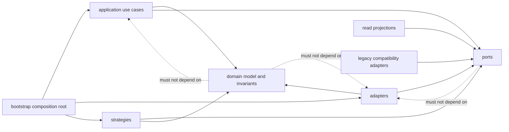
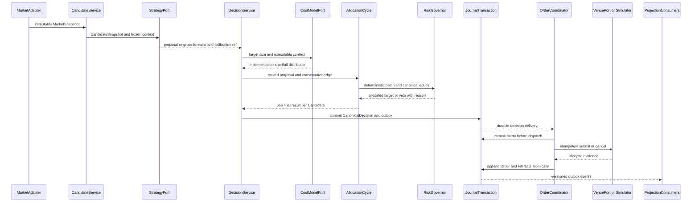
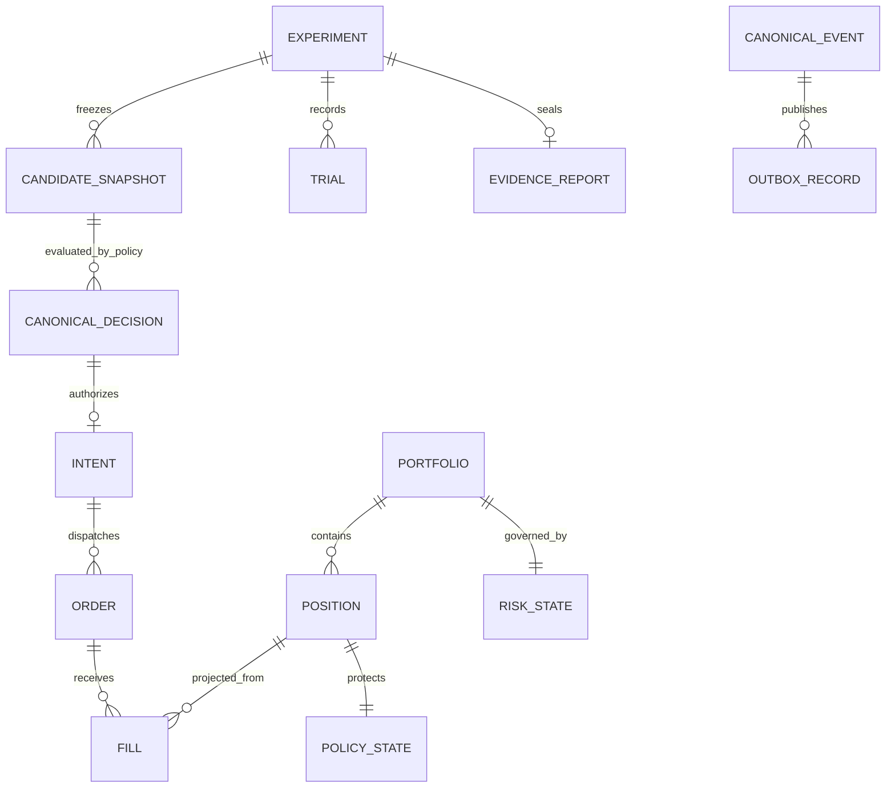
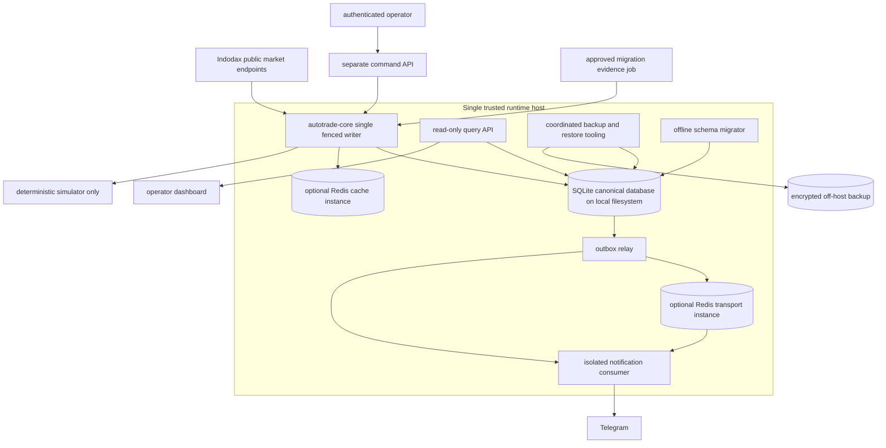

# Architecture Spine — AutoTrade Replacement

## Design Paradigm

AutoTrade Replacement adalah **hexagonal modular monolith** dengan **append-only canonical facts**. Domain menyatakan fakta dan invariant; application mengorkestrasi use case; port menjadi satu-satunya kontrak lintas batas; adapter menangani Indodax, simulator, SQLite, Redis opsional, dashboard, Telegram, dan legacy. `bootstrap` hanya merangkai dependency. Tidak ada adapter yang menjadi sumber kebenaran kedua.



Panah solid adalah arah dependency yang diizinkan. Panah putus-putus menyatakan larangan dependency, bukan aliran runtime.

## Invariants & Rules

### AD-01 — Hexagonal modular monolith

- **Binds:** seluruh capability dan source tree pengganti.
- **Prevents:** god object, callback silang, serta domain yang bergantung pada database, exchange, cache, UI, atau framework.
- **Rule:** allowed import matrix adalah: `domain → stdlib/domain`; `ports → domain`; `application → domain+ports`; `strategies → domain+ports`; `adapters/projections → domain+ports`; dan `bootstrap → semua layer` hanya untuk composition. Import sebaliknya atau horizontal antar-adapter dilarang; seluruh I/O melewati typed port; `bootstrap` adalah satu-satunya composition root. Modul legacy hanya boleh masuk sebagai adapter. CI wajib menjalankan forbidden-import contract test atas matrix ini.

### AD-02 — Canonical identity, numeric, and time conventions `[ADOPTED]`

- **Binds:** FR-1–FR-34.
- **Prevents:** tabrakan eksperimen, pembulatan uang, timezone drift, serta hasil replay yang ambigu.
- **Rule:** setiap aggregate membawa `authority_scope_id`, `portfolio_id`, `experiment_id`, `strategy_version`, `horizon_id`, `instrument_id`, dan `writer_epoch` yang relevan. Jenis ID mengikuti mapping deterministik pada Consistency Conventions; fresh UUID atau wall clock dilarang pada replay. Waktu disimpan sebagai UTC event time dan receive time; uang, harga, fee, dan quantity memakai fixed-point integer atau `Decimal`, tidak pernah binary float atau SQLite `REAL`.

### AD-03 — One Candidate, one Canonical Decision `[ADOPTED]`

- **Binds:** FR-1–FR-5, FR-28.
- **Prevents:** action yang berbeda antara log, dashboard, persistence, replay, shadow evaluation, dan execution.
- **Rule:** satu immutable `CandidateSnapshot` menghasilkan tepat satu `CanonicalDecision` per `policy_version`. Gate hanya boleh menambahkan evidence atau melakukan veto sebelum commit; sesudah commit tidak ada komponen yang boleh mengganti action, reason, boundary, atau snapshot reference. Koreksi terlambat membuat revision baru dan tidak menulis ulang decision lama.

### AD-04 — State-legal actions and fixed exit precedence `[ADOPTED]`

- **Binds:** FR-2, FR-4–FR-5, FR-8–FR-9, FR-17–FR-21.
- **Prevents:** `HOLD` tanpa Position, `ABSTAIN` saat masih ada exposure, pyramiding tersembunyi, atau alpha menahan protective exit.
- **Rule:** tanpa Position hanya `ENTER` atau `ABSTAIN` yang legal; dengan Position hanya `HOLD` atau `EXIT`; MVP tidak melakukan pyramiding. Precedence tertinggi ke terendah adalah operator kill, hard drawdown, hard invalidation atau stop, reconciliation, profit atau trailing atau time stop, alpha `EXIT`, lalu `HOLD`. Setiap `EXIT` menyatakan target quantity eksplisit. Initial confirmation baseline `[ASSUMPTION]` adalah dua closed bars berurutan untuk `ENTER`, satu untuk protective `EXIT`, dan dua untuk alpha-only `EXIT`. Data gap atau bar yang tidak memenuhi quality contract hanya mereset `ENTER` confirmation; ia tidak pernah mereset Position protection/high-water state atau menunda protective `EXIT`. Policy version boleh mengganti baseline hanya sebelum evidence window dibuka.

### AD-05 — Fill journal is the sole accounting authority `[ADOPTED]`

- **Binds:** FR-6–FR-11, FR-28, FR-32–FR-34.
- **Prevents:** cash atau Position berubah saat intent dibuat, ghost Position, exit ganda, dan perbedaan saldo antar tabel.
- **Rule:** hanya canonical Fill fact tervalidasi, termasuk approved external Fill import, yang mengubah cash, fee, tax, dan exposure. Venue balance, order, dan trade responses adalah external reconciliation evidence; mereka baru memengaruhi accounting setelah tervalidasi menjadi Fill atau additive correction event. Lifecycle facts bersifat append-only, ordered, idempotent, dan dapat direplay. Local legacy `trades`, `pending_orders`, balance tables/views, positions, Redis state, serta UI adalah projection yang dapat dibangun ulang. Setiap event menyimpan payload hash dan previous stream hash; periodic head checkpoint disalin off-host dan diverifikasi oleh read authority yang terpisah agar rewrite atau storage rollback terdeteksi.

### AD-06 — One command boundary and atomic outbox

- **Binds:** FR-6–FR-11, FR-20–FR-21, FR-28–FR-34.
- **Prevents:** direct database write, event hilang sesudah commit, acknowledgment prematur, dan dual-write parsial.
- **Rule:** seluruh mutasi melewati application command handler yang menjadi satu-satunya pemilik begin/commit/rollback `UnitOfWork`; repository/journal port hanya tersedia sebagai transaction-scoped capability dan tidak boleh dibuka coordinator atau adapter. Tidak ada transaction melintasi network, Venue, atau Redis call. Handler secara atomik memverifikasi fence dan expected sequence, menjalankan transition domain, lalu mengikat canonical event dan `PENDING` outbox; hanya commit success boleh diakui sebagai success. Typed outcome membedakan `COMMITTED`, `REJECTED`, `CONFLICT`, `FENCE_LOST`, `TRANSIENT_PRECOMMIT`, dan `INDETERMINATE_COMMIT`. Retry hanya pada command envelope dengan identity/causation yang sama. Delivery bersifat at-least-once. Setiap consumer secara atomik mengikat idempotent effect atau inbox dedupe dengan checkpoint miliknya, lalu mengakui transport hanya setelah commit. Dispatcher menandai delivery hanya setelah transport acknowledgment; crash boleh menyebabkan redelivery tetapi tidak boleh menghilangkan event. Exhausted retry mempertahankan payload, attempt history, dan recovery evidence di dead-letter; backlog atau dead-letter pada consumer trading-critical langsung membekukan entry.

### AD-07 — Persistently fenced single writer `[ADOPTED]`

- **Binds:** FR-20, FR-29, FR-32–FR-34.
- **Prevents:** split brain, stale process menulis setelah takeover, dan local lock yang gagal lintas process atau host.
- **Rule:** satu canonical `writer_authority` row per `authority_scope_id` diklaim dengan `BEGIN IMMEDIATE` dan compare-and-swap. Setiap acquisition menaikkan monotonically increasing `writer_epoch` dan menerbitkan `writer_token` yang tidak pernah digunakan ulang; setiap append memverifikasi scope, epoch, token, dan expected sequence di dalam transaction yang sama. Lease expiry hanya mekanisme liveness, bukan safety authority; PID, file lock, Redis lock, atau timestamp saja tidak memberi write authority, dan clock anomaly membekukan write. Planned transfer menghentikan serta menguras writer lama; unplanned takeover memerlukan lease expiry, epoch lebih tinggi, dan reconciliation.

### AD-08 — Point-in-time MarketSnapshot and dynamic universe `[ADOPTED]`

- **Binds:** FR-1, FR-12–FR-16, FR-22, FR-25.
- **Prevents:** look-ahead, survivorship bias, candle-close fills, stale cache substitution, dan ukuran order yang mengabaikan depth.
- **Rule:** semua policy pada satu Candidate menerima `MarketSnapshot` immutable yang sama: ordered L2 depth, `venue_cursor` bila disediakan, locally assigned `ingest_cursor`, `cursor_capability`, quality status, event dan receive time, freshness, instrument-rules version, universe membership, serta exclusion reason. Local cursor tidak membuktikan venue-gap freedom. Incremental book tanpa authoritative sequence harus direcover dari snapshot yang contract-tested; bila continuity yang diwajibkan tidak dapat dibuktikan, Candidate menjadi `INELIGIBLE` atau entry tetap frozen. Eligibility efektif-waktu mencakup seluruh spot-IDR yang lolos rule. Insufficient depth atau metadata invalid pada satu pair menghasilkan pair-local exclusion/`ABSTAIN`; hanya systemic integrity failure membekukan portfolio-wide entry. Last price tidak pernah menggantikan executable depth.

### AD-09 — Pure and isolated Champion–Challenger

- **Binds:** FR-22–FR-27.
- **Prevents:** Challenger dipengaruhi action Champion, shared mutable state, hasil yang tidak comparable, atau legacy otomatis menjadi incumbent.
- **Rule:** Champion dan setiap Challenger mengimplementasikan pure `StrategyPort`, menerima frozen snapshot, opportunity set, venue rules, dan `CostModel` version yang sama, serta memiliki policy state, decision ledger, dan outcome ledger terpisah. Strategy hanya menghasilkan proposal, score, atau gross-return distribution dengan calibration reference; `DecisionService`, bukan Strategy, membentuk net edge memakai size-specific implementation-shortfall distribution. Counterfactual Challenger fills berasal dari simulator dan selalu berlabel `COUNTERFACTUAL`, tidak dicampur dengan observed Champion evidence. Initial executable policy adalah `NoEntryChampion`; simple momentum maupun legacy tetap Challenger sampai canonical conformance dan seluruh promotion gate lulus.

### AD-10 — Cost-aware abstention and bounded adaptation `[ADOPTED]`

- **Binds:** FR-4–FR-5, FR-16–FR-18, FR-21–FR-27.
- **Prevents:** overtrading, threshold berubah setelah hasil terlihat, regime detector menciptakan alpha, dan retraining otomatis.
- **Rule:** `DecisionService` membentuk executable net-edge distribution dari gross-return distribution/evidence dan implementation-shortfall distribution. Shortfall mencakup fee, tax/clearing, spread, slippage, impact, latency-conditioned adverse selection, serta opportunity cost/non-fill; uncertainty memilih conservative quantile/coverage dan tidak dikurangkan sebagai nilai uang. `ENTER` hanya legal bila preregistered conservative statistic, misalnya lower gross quantile dikurangi upper cost quantile, melewati margin. Ketika flat, missing/stale calibration menjadi `ABSTAIN`; ketika exposed, kondisi yang sama memblokir penambahan exposure tetapi tetap mengizinkan `HOLD` atau protective `EXIT`. Safety detector hanya boleh menerbitkan `EntryFreezeRequested` atau `SafetyDeactivationRequested`; hanya audited governance command yang mengubah Champion status. Tidak ada auto-retrain, auto-promotion, atau detector yang mengalahkan protective `EXIT`.

### AD-11 — Independent persisted RiskGovernor `[ADOPTED]`

- **Binds:** FR-17–FR-21, FR-29, FR-31.
- **Prevents:** alpha mengubah limit, risk check memakai equity berbeda, VaR fail-open, drawdown peak direset, atau sizing meningkatkan hard envelope.
- **Rule:** `RiskGovernor` memiliki state persisten dan menghitung semua limit dari satu canonical equity snapshot. Normative envelope adalah: notional satu Position maksimal 10% decision-time equity; total open exposure 40% canonical equity; daily loss 2% dari cash-flow-adjusted start-of-day equity; planned loss ke hard stop 0,5% decision-time equity; dan hard drawdown trigger 10% dari persisted cash-flow-adjusted equity peak. Daily loss memakai perubahan canonical equity realized plus unrealized pada session `Asia/Jakarta` `[ASSUMPTION]`. Planned loss memakai conservative stop execution termasuk fee, slippage, dan exit liquidity; missing stop distance atau exit capacity menolak entry. Karena MVP hanya mengizinkan satu Position per pair, pair exposure juga maksimal 10%. Risk-increasing entry turnover maksimal 40% equity per rolling 24 jam `[ASSUMPTION]`; risk-reducing `EXIT` tidak pernah diblokir turnover. Liquidity, correlation, stop distance, volatility, dan uncertainty hanya boleh menurunkan sizing. Hard-drawdown breach wajib membatalkan seluruh unfilled risk-increasing entry, latch entry, dan menerbitkan protective `EXIT` berprecedence tertinggi menuju target zero exposure; ini trigger risk reduction, bukan jaminan realized-loss cap. Kill, drawdown, stale-data, UNKNOWN-order, dan reconciliation latch fail-closed untuk entry dan mengikuti AD-27.

### AD-12 — One OrderCoordinator, one lifecycle across venue and simulator

- **Binds:** FR-6–FR-8, FR-10–FR-16, FR-18–FR-21.
- **Prevents:** runtime atau monitor mengirim order langsung, simulator memakai lifecycle lebih sederhana, duplicate resubmission, dan timeout dianggap reject.
- **Rule:** hanya `OrderCoordinator` dapat submit atau cancel melalui `VenuePort`. Venue adapter dan simulator menghasilkan state machine serta event schema yang sama. `client_order_id`, idempotency key, dan expected sequence bersifat deterministik. Timeout atau ambiguous acknowledgment menjadi `UNKNOWN`; exposure baru dibekukan sampai recovery membuktikan terminal state.

### AD-13 — Sequence-aware Indodax recovery

- **Binds:** FR-6, FR-10–FR-16, FR-18, FR-21, FR-32.
- **Prevents:** websocket gap dianggap data lengkap, out-of-order event merusak book, dan deprecated history menjadi evidence authoritative.
- **Rule:** adapter memisahkan venue-provided cursor dari locally assigned receive cursor serta merekam capability/quality. Gap yang terbukti, continuity yang tidak dapat dibuktikan, disconnect, clock breach, atau ambiguous order event memicu snapshot/REST recovery dan reconciliation sebelum entry terkait dibuka kembali. Legacy fallback dilarang. Admission registry AD-29 memetakan Public REST, Private REST API, Trade API 2.0, Market Data WebSocket, dan Private WebSocket sebagai kontrak terpisah; hanya capability/field yang lulus contract test boleh menjadi authoritative venue evidence. WebSocket message adalah evidence masuk, bukan otomatis canonical fact.

### AD-14 — Deterministic replay bundle `[ADOPTED]`

- **Binds:** FR-1, FR-3, FR-10, FR-15, FR-22–FR-26, FR-32–FR-34.
- **Prevents:** replay berubah karena dependency, clock, seed, metadata, universe, atau external response yang tidak tercatat.
- **Rule:** replay memiliki tiga mode bernama: canonical-state rehydration, decision/lifecycle regeneration, dan projection rebuild. Manifest membekukan ordered input IDs, MarketSnapshot, universe, initial portfolio/risk state, cursors, fee/instrument rules, strategy, model, calibrator, simulator, cost model, config, schema, code commit, image digest, dependency lock, runtime numeric version, RNG algorithm/seed, serta semua clock/external response yang dibaca. Seluruh regenerated ID, timestamp, dan ordering key berasal dari recorded input atau deterministic derivation. Comparison memakai versioned canonical semantic projection/hash yang secara eksplisit mendaftar observability fields yang dikecualikan. Dua replay dari clean store wajib menghasilkan terminal state dan semantic hash identik; external-call counter tetap nol.

### AD-15 — Evidence Specification before evaluation `[ADOPTED]`

- **Binds:** FR-16, FR-22–FR-27, FR-30–FR-31.
- **Prevents:** leakage, benchmark diganti sesudah melihat hasil, failed trial dihapus, p-hacking, dan promotion hanya karena backtest profit.
- **Rule:** sebelum window dibuka, `EvidenceSpecification` mengunci universe, horizon, sampling unit, purge dan embargo yang diturunkan dari maksimum label/holding overlap, effective-sample rule, regime coverage, benchmark, cost model, calibration metric, bootstrap/CV, DSR, PBO, concentration, serta conjunctive pass logic. Trial family mencakup seluruh feature, parameter, threshold, model, dan failed attempt yang pernah dicoba; DSR dan PBO saling melengkapi, bukan substitusi. Closed `UNSCORABLE` taxonomy hanya: `STALE_OR_GAPPED_SOURCE`, `DELISTING_OR_HALT`, `MISSING_REQUIRED_HORIZON_DATA`, dan `INVALID_INSTRUMENT_METADATA`. Reason wajib ditetapkan dari point-in-time evidence tanpa membaca realized outcome; post-hoc relabel dilarang. Initial promotion ceiling adalah 5% matured Candidate `[ASSUMPTION]`; reason baru membuat evidence window tidak comparable sampai specification baru disetujui. Promotion memerlukan sealed immutable report, final frozen chronological holdout, forward shadow evidence, dan approval manusia.

### AD-16 — SQLite canonical store; Redis never authoritative

- **Binds:** FR-3, FR-6–FR-11, FR-20–FR-21, FR-28–FR-34.
- **Prevents:** cache eviction menghapus fakta, queue volatile menjadi ledger, multi-writer checkpoint race, dan Redis outage menghentikan recovery.
- **Rule:** SQLite menyimpan canonical journal, aggregate state, trial ledger, audit, dan transactional outbox melalui satu application writer dengan transaction singkat. Jika Redis dipakai sebagai transport, transport memakai instance, persistence, dan eviction domain terpisah dari cache; logical namespace atau Redis DB saja tidak cukup dan `allkeys-*` eviction dilarang untuk transport. Redis tetap non-authoritative; seluruh delivery dapat dibentuk ulang dari SQLite outbox setelah Redis hilang total, dan sistem pulih benar tanpa Redis.

### AD-17 — Read-only operational consumers

- **Binds:** FR-21, FR-28–FR-31.
- **Prevents:** Telegram atau dashboard menahan commit, display menghitung action sendiri, dan UI mengubah database secara langsung.
- **Rule:** dashboard dan Telegram membaca versioned projection melalui query port secara asynchronous. Notification failure tidak mengubah decision, order, settlement, atau risk state. Write action operator memakai command surface terpisah yang authenticated, authorized, idempotent, dan menghasilkan immutable approval atau audit event.

### AD-18 — Portfolio-namespace authority cutover; no dual settlement `[ADOPTED]`

- **Binds:** FR-11, FR-20, FR-27, FR-32–FR-34.
- **Prevents:** dua engine mengelola scope exposure yang sama, shadow melanggar single-writer, rollback menghidupkan direct writer lama, dan history ditimpa backup lama.
- **Rule:** setiap authority diikat oleh `authority_scope_id`; MVP hanya berwenang atas virtual AutoTrade portfolio. Sebelum cutover, shadow menulis ke file SQLite dan portfolio namespace terisolasi serta hanya membaca immutable mirror; legacy dan replacement tidak pernah menulis canonical file yang sama. Cutover bersifat stop-the-world untuk scope tersebut: freeze config/entry, hentikan seluruh legacy scheduler/direct writer, drain outbox, checkpoint, backup, import/reconcile, buktikan zero unresolved working `UNKNOWN`, lalu klaim epoch lebih tinggi dan start target. Administrative close terhadap `UNKNOWN` dilarang. Rollback adalah fenced cutover baru ke release replacement sebelumnya atau `SHADOW_ONLY/SAFE_LATCHED`: freeze, stop/drain, reconcile, verifikasi schema/event compatibility, lalu klaim epoch lebih tinggi. Legacy writer tidak dapat dipulihkan lewat config, backup tidak boleh menimpa facts pasca-cutover, dan seluruh event tetap append-only. Jika future live trading berbagi exchange account, scope authority wajib mencakup seluruh mutator account itu.

### AD-19 — Reproducible and SQLite-safe runtime

- **Binds:** FR-3, FR-10, FR-15, FR-20, FR-22, FR-32–FR-34.
- **Prevents:** Docker dan host memakai runtime berbeda, dependency range bergeser, serta WAL corruption pada SQLite rentan.
- **Rule:** CI menjalankan `uv lock --check` dan `uv sync --frozen --no-dev`, mem-pin tool artifact/checksum dan base image by digest, membangun artifact satu kali, lalu menguji dan mempromosikan digest yang sama tanpa runtime dependency resolution. Qualified build recipe wajib menghasilkan CPython 3.12.14 yang benar-benar linked ke SQLite 3.53.4; CI memverifikasi `sys.version`, `sqlite3.sqlite_version`, `sqlite_source_id()`, compile options, PRAGMA efektif, dependency compatibility, dan committed `pyproject.toml`/`uv.lock`. Manifest memuat commit, application/base-image digest, tool/checksum, lock hash, config/risk-policy hash, schema, CPython, SQLite version/source ID/compile options, dan SBOM; mismatch fail-closed. Runtime memakai exact SQLite allowlist, bukan numeric lower bound: initial qualified build adalah 3.53.4 dengan source ID `2026-07-24 19:02:57 bf7c7f30031888f4e796e429ab3978879485813aaca6f641c7b33e4e09459bcc`; withdrawn release atau unproven distro backport ditolak. Writer memverifikasi effective `journal_mode=WAL`, `synchronous=FULL`, `foreign_keys=ON`, dan bounded `busy_timeout`; Read API memakai URI `mode=ro` dan `query_only=ON`. Core adalah satu-satunya checkpoint authority; WAL size, oldest-reader/checkpoint age, `SQLITE_BUSY`, dan disk headroom dimonitor. Connection tidak berpindah process atau diwariskan melewati fork; database berada pada local filesystem dengan locking SQLite.

### AD-20 — DRY RUN physically excludes live execution authority `[ADOPTED]`

- **Binds:** seluruh MVP, khususnya FR-6–FR-8, FR-12–FR-21, FR-27, FR-31.
- **Prevents:** salah config mengubah simulasi menjadi live order, shared process membawa credential trading, dan emergency path melewati simulator.
- **Rule:** artifact dan process DRY RUN tidak menyertakan live submission adapter atau private credential yang memiliki trade permission. Semua order melewati deterministic simulator. Tool migration atau recovery yang memerlukan venue evidence berjalan sebagai job terpisah dengan least privilege, explicit operator approval, dan tidak mempunyai path submit. Live trading adalah perubahan post-MVP dengan security review dan approval baru.

### AD-21 — Safety gates, operational SLOs, and trading KPIs are distinct

- **Binds:** FR-3, FR-10–FR-21, FR-24–FR-34.
- **Prevents:** availability dianggap correctness, profit menutupi invariant failure, serta degraded mode terus membuka exposure.
- **Rule:** safety invariant adalah absolute release/runtime gate; operational availability, freshness, latency, backlog, dan recovery time adalah SLO; expectancy, drawdown, calibration, turnover, dan execution quality adalah evidence KPI. Sebelum readiness observation, setiap SLO wajib memiliki SLI numerator/denominator, threshold, window, exclusions, owner, alert/action, dan error-budget policy; baseline berubah hanya melalui versioned approval. Exactly one writer, hard risk envelope, no entry saat stale/latched/unreconciled, Fill/accounting conservation, dan zero replay side effect selalu 100% non-budgetable. Degradation bergerak `HEALTHY` → `ENTRY_FROZEN` → `SHADOW_ONLY` → `SAFE_LATCHED`, memblokir `ENTER` lebih dahulu sambil mempertahankan reconciliation dan protective exit jika venue evidence memadai.

### AD-22 — Backup, restore, and reconciliation are release gates

- **Binds:** FR-10–FR-11, FR-19–FR-21, FR-28–FR-34.
- **Prevents:** file copy yang tidak konsisten, backup yang tidak pernah direstore, projection drift, dan cutover dengan legacy ambiguity.
- **Rule:** backup memakai SQLite Online Backup API atau mekanisme terdokumentasi dengan transactional snapshot semantics setara. Raw `cp`, rename, atau single-file copy terhadap database aktif ketika WAL ada dilarang. Cutover backup berada di belakang writer barrier setelah outbox drain dan reconciliation, serta mencatat event/outbox high-water, schema, runtime, config, dan policy hashes. Backup baru berhasil setelah encrypted copy, checksum, dan retention record tersimpan off-host. Release memerlukan isolated restore, `integrity_check`, `foreign_key_check`, event replay, projection rebuild, invariant suite, measured RPO/RTO, dan reconciliation. Database restore hanya menggantikan target setelah seluruh source connection ditutup. Acceptance migration adalah zero unexplained mismatch, zero unresolved working `UNKNOWN`, dan disposition teraudit untuk seluruh ambiguous record.

### AD-23 — Offline and versioned schema migration

- **Binds:** FR-3, FR-10–FR-11, FR-20, FR-22, FR-32–FR-34.
- **Prevents:** startup runtime menjalankan DDL, schema drift merusak replay, dan rollback artifact tidak memahami event baru.
- **Rule:** schema hanya berubah melalui ordered forward migration pada pre-start/offline migration role ketika core writer berhenti. Runtime startup tidak boleh `CREATE`, `ALTER`, atau implicit migrate; ia hanya menerima explicit supported schema set. Migration ID, checksum, source/target schema, artifact digest, backup reference, dan reconciliation result masuk manifest serta replay evidence. Rollback atau reverse cutover hanya memakai artifact yang terbukti membaca schema dan seluruh canonical event terkini.

### AD-24 — Deterministic portfolio-wide allocation cycle

- **Binds:** FR-1–FR-5, FR-17–FR-18, FR-22, FR-25, FR-28.
- **Prevents:** cross-sectional ranking bergantung urutan pair, dua Horizon memperebutkan pair yang sama, dan portfolio sizing memakai equity/liquidity context berbeda.
- **Rule:** Candidate pada satu deterministic cutoff masuk `AllocationCycle` bersama frozen opportunity set, canonical equity, liquidity/capacity, correlation snapshot, working orders, dan Position state yang sama. Strategy dan cost evaluation menghasilkan per-Candidate proposal; `RiskGovernor` mengarbitrasi batch dengan versioned deterministic tie-break dan menerbitkan satu final `CanonicalDecision` untuk setiap Candidate, termasuk loser dengan structured `ABSTAIN` reason. Satu pair hanya boleh dimiliki satu Horizon pada MVP. Protective risk-reducing actions melewati entry arbitration dengan precedence AD-04.

### AD-25 — Calibration and regime state are explicit facts

- **Binds:** FR-3–FR-5, FR-16, FR-21–FR-27, FR-30.
- **Prevents:** hidden online model state, conformal coverage disalahartikan sebagai profit probability, dan operational detector diam-diam menciptakan alpha.
- **Rule:** out-of-fold/static calibration dan monitoring proper score/coverage wajib untuk executable policy. Adaptive or conformal online calibration tetap Challenger sampai evidence lolos; setiap accepted update menghasilkan canonical `CalibrationUpdated` fact dengan prior/new artifact hash, effective time, causal evidence, dan policy version sehingga replay identik. `ResearchRegimeFeature` hanya boleh mengondisikan proposal di dalam versioned Challenger. `SafetyChangeAlarm` hanya meminta entry freeze atau risk reduction. Setiap `RegimeObservation` menyimpan model version, `effective_at`, `computed_at`, probability vector, change score, confidence, freshness, serta dwell/hysteresis state.

### AD-26 — Canonical encoding, journal order, and identity

- **Binds:** FR-1–FR-16, FR-22–FR-34.
- **Prevents:** producer dan replay menghasilkan ID berbeda, hash chain tidak saling dapat diverifikasi, atau schema upcast mengubah bukti asli.
- **Rule:** satu versioned Canonical Encoding Contract menetapkan UTF-8 canonical JSON profile, Unicode NFC, sorted map keys, absent-versus-null, enum strings, UTC `Z` timestamp grammar, scaled-integer numeric representation, domain-separated SHA-256 input projection per ID kind, dan lowercase hex storage. `authority_scope_id` journal memiliki monotonic `journal_seq`, deterministic intra-transaction order, dan previous-global-hash; hash memakai stored original envelope+payload bytes, sedangkan upcast menghasilkan view tanpa mengubah bytes tersebut. Perubahan recipe membuat version baru, tidak menulis ulang ID lama. Golden vectors lintas producer, replay, simulator, migration, journal, dan projection wajib lulus sebelum schema atau recipe diterima.

### AD-27 — Atomic allocation, risk consistency cut, and safety ownership

- **Binds:** FR-2–FR-11, FR-17–FR-21, FR-28–FR-34.
- **Prevents:** dua Horizon mengklaim pair yang sama, entry memakai Fill/risk state tertinggal, serta UNKNOWN/freeze dibuka oleh owner berbeda.
- **Rule:** `PortfolioAllocation` adalah serialization aggregate per `(authority_scope_id, portfolio_id)`; satu CAS transaction mengikat cycle cutoff, final Decision batch, unique active pair-to-Horizon ownership, risk-increasing reservation, RiskState transition, canonical events, dan outbox. Conflict menghasilkan non-executable `ABSTAIN`/supersession fact; tidak ada partial executable batch. Setiap risk-increasing decision membawa journal high-water dan market cutoff yang sama untuk accounting/Fill, Position, working-order reservation, turnover, peak/daily loss, reconciliation, dan SafetyState; checkpoint yang tertinggal satu event pun menolak entry. Reservation adalah quantitative ledger `initial = consumed + active_remainder + released` untuk notional, planned loss, fee, conservative slippage/impact buffer, dan turnover. Partial Fill mengonsumsi hanya conservative filled share dan mempertahankan active remainder untuk seluruh executable unfilled quantity; rounding residual tetap reserved. `PARTIALLY_FILLED` dan `UNKNOWN` tidak melepaskan capacity. Hanya proven non-executable remainder pada terminal reject/cancel/expiry dilepas; setiap transition atomically menjaga conservation dan property test. Satu canonical `SafetyState` aggregate memiliki typed cause ID, scope, severity, evidence refs, deterministic severity-and-scope join, expected sequence, serta clear contract pada Safety Cause Matrix. `OrderCoordinator` melaporkan lifecycle evidence tetapi hanya SafetyState command yang membuka/menutup degradation; clearing satu cause tidak menurunkan effective state selama cause lain masih aktif. Protective `EXIT` tetap legal hanya bila evidence cukup untuk tidak memperbesar risiko. Operator kill mengikuti state machine `ARMED → TRIGGERED → CANCEL_PENDING → EXIT_PENDING → RECONCILING → LATCHED_SAFE`: trigger segera menolak entry; cancel memakai deadline/retry; UNKNOWN di-query sebelum resubmit; protective EXIT dipertahankan menuju zero; reconciliation wajib; hanya approval operator dengan evidence lengkap dapat kembali ke `ARMED`.

### AD-28 — Horizon and evidence lifecycle governance

- **Binds:** FR-1–FR-5, FR-22–FR-34 dan Data Governance PRD.
- **Prevents:** scheduler memakai maturity berbeda, evidence aktif terhapus, atau retention berbeda antar storage/backup.
- **Rule:** initial Horizon registry `[ASSUMPTION]` adalah `15M`, `1H`, `4H`, `1D` dengan label maturities `1h`, `4h`, `24h`, `72h`; registry efektif-waktu dan versioned mengikat Candidate, label, evaluation cadence, serta universe membership. Initial minimum retention `[ASSUMPTION]` adalah raw L2 30 hari, CandidateSnapshot/replay manifest 2 tahun, dan canonical/evidence/audit 7 tahun. Reference aktif dari Experiment, EvidenceSpecification, report, promotion, incident, legal hold, atau replay bundle menunda expiry. Cleanup adalah authenticated command yang menghasilkan deletion manifest/tombstone berisi policy version, cutoff, object hashes, reference check, actor, dan approval; canonical lifecycle fact tidak dihapus in-place. Capacity dapat memperpanjang atau memindahkan tier, tetapi tidak memperpendek baseline tanpa versioned approval dan sealed-evidence impact review.

### AD-29 — Versioned venue capability registry

- **Binds:** FR-6, FR-10–FR-16, FR-18–FR-21, FR-32.
- **Prevents:** semantics satu produk Indodax diterapkan ke produk lain atau undocumented fallback menjadi evidence authoritative.
- **Rule:** registry efektif-waktu mencatat untuk setiap product/base URL/endpoint/channel: documentation commit/version, authentication scope, authoritative fields, cursor/offset/sequence semantics, snapshot source, rate limit, timestamp contract, recovery route, dan contract-test artifact. Public REST, Private REST API, Trade API 2.0, Market Data WebSocket, dan Private WebSocket memiliki entry terpisah. Capability yang belum dibuktikan berstatus `UNQUALIFIED`, tidak boleh mengisi canonical fact, dan membekukan entry yang bergantung padanya.

## Safety Cause Matrix

Scope membentuk lattice `ORDER < INSTRUMENT < PORTFOLIO < AUTHORITY`; propagation hanya naik bila shared exposure/equity, systemic source, atau authority integrity terpengaruh. Join memilih scope dan severity tertinggi; cause tidak pernah saling menghapus.

| Cause | Default / escalation scope | Effective state and protective action | Clear predicate |
| --- | --- | --- | --- |
| `OPERATOR_KILL` | `AUTHORITY` | `SAFE_LATCHED`; cancel entry, target zero, reconcile | Tidak otomatis; state machine FR-19 selesai dan operator approval dengan evidence lengkap |
| `HARD_DRAWDOWN` | `PORTFOLIO` | `SAFE_LATCHED`; cancel entry, target zero, quarantine dust | Tidak otomatis; zero/accepted dust, complete reconciliation, approved incident recovery |
| `STALE_DATA` | `INSTRUMENT`; naik `PORTFOLIO` bila systemic | `ENTRY_FROZEN`; protective exit hanya dengan conservative qualified evidence | Otomatis sesudah required consecutive fresh snapshots dan no higher cause; count dipin policy |
| `MARKET_CONTINUITY` | affected `INSTRUMENT`; naik bila shared stream | `ENTRY_FROZEN`; snapshot/REST recovery | Otomatis hanya sesudah gap recovery/continuity contract terbukti dan reconciliation checkpoint current |
| `UNKNOWN_ORDER` | `ORDER`; naik `INSTRUMENT`, lalu `PORTFOLIO` bila exposure/equity ambiguous | `ENTRY_FROZEN`; query-before-resubmit, cancel/exit sesuai evidence | Terminal venue/simulator proof plus Fill/order reconciliation; tidak ada administrative close; operator approval bila ambiguity tidak dapat dibuktikan terminal |
| `RECONCILIATION` | mismatch scope, minimal `INSTRUMENT` | `ENTRY_FROZEN` atau `SAFE_LATCHED` bila accounting/authority mismatch | Zero unexplained mismatch, checkpoints current, correction events committed; approval untuk additive correction |
| `DELIVERY_CRITICAL` | consumer effect scope; `PORTFOLIO` bila trading-critical | `ENTRY_FROZEN`; reconciliation tetap berjalan | Backlog di bawah threshold, dead-letter disposition committed, consumer checkpoint current |
| `CLOCK_ANOMALY` | `AUTHORITY` | `SAFE_LATCHED`; stop mutation kecuali bounded recovery | Monotonic/UTC checks stable, epoch reacquired, replay/reconciliation passed, operator approval |
| `STORAGE_FAILURE` | `AUTHORITY` | `SAFE_LATCHED`; no entry/write beyond safe failure handling | Integrity, disk headroom, WAL/checkpoint, restore/restart, and reconciliation gates pass; operator approval |
| `WRITER_FENCE_LOSS` | `AUTHORITY` | `SAFE_LATCHED`; stale writer performs no mutation | Higher epoch writer established, stale process stopped, reconciliation passed; operator approval |

## Consistency Conventions

| Concern | Convention |
| --- | --- |
| Aggregate and entity names | Singular `PascalCase`; port berakhiran `Port`; repository berakhiran `Repository`; command memakai imperative noun; event memakai past tense. |
| Files and modules | `snake_case`; satu public responsibility per module; adapter dinamai menurut provider dan role, misalnya `indodax_market_adapter.py`. |
| Identifiers | Candidate, Decision, Intent, dan client-order ID memakai versioned deterministic digest dari canonical bytes; venue Fill memakai venue namespace + stable venue Fill ID; exogenous event tanpa upstream ID memakai UUIDv7 yang langsung direkam. Retry tidak membuat semantic ID baru. |
| Events | Envelope minimum: `event_id`, `event_type`, `schema_version`, `aggregate_id`, `aggregate_seq`, `occurred_at_utc`, `recorded_at_utc`, `correlation_id`, `causation_id`, `authority_scope_id`, `writer_epoch`, `payload_hash`, `previous_stream_hash`. |
| Numeric values | `Decimal` di domain, canonical integer minor units atau scaled integers di storage; rounding mode dan scale mengikuti instrument-metadata version. |
| Time | ISO-8601 UTC pada boundary; monotonic clock untuk duration; event time dan receive time tidak boleh digabung menjadi satu field. |
| State transitions | Enum uppercase; setiap transition memeriksa expected sequence dan menghasilkan event atau typed rejection; tidak ada silent fallback. |
| Errors | Typed `error_code`, `severity`, `retryable`, `evidence_ref`, dan `correlation_id`; exception adapter dipetakan sebelum masuk application. |
| Configuration | Immutable versioned config snapshot per Candidate dan Experiment; precedence tunggal; secret hanya dari runtime secret provider dan tidak diserialisasi ke replay. |
| Logging and metrics | Structured logs memakai correlation trail yang sama dengan event; metric label tidak memuat raw pair tanpa bounded registry; secret dan private payload selalu di-redact. |
| Authentication and approval | Read dan command surface terpisah; mutasi sensitif memerlukan actor, role, reason, evidence reference, idempotency key, serta immutable audit event. |

## Stack

| Name | Version |
| --- | --- |
| CPython | 3.12.14 |
| SQLite | 3.53.4 |
| uv | 0.11.15 |

## Operational Baseline

Nilai `[ASSUMPTION]` berikut mengikat sebagai initial fail-closed baseline. Telemetry dapat memperketat atau mengubahnya hanya melalui versioned approval sebelum readiness window berikutnya.

| Contract | Initial baseline | Enforcement |
| --- | --- | --- |
| Executable L2 freshness | Age maksimum 3 detik; clock skew maksimum 1 detik; authoritative sequence gap nol `[ASSUMPTION]` | Candidate ditolak; systemic breach membekukan entry. |
| Decision deadline | Candidate-to-committed Decision p99 maksimum 1 detik dan selalu sebelum snapshot age 3 detik `[ASSUMPTION]` | Late Decision menjadi non-executable `ABSTAIN` atau mempertahankan protective action. |
| UNKNOWN recovery | Recovery deadline 60 detik `[ASSUMPTION]` | Scope terkait tetap entry-frozen sesudah deadline dan incident dieskalasi; Order tidak ditutup administratif. |
| Recovery objective | RTO DRY RUN maksimum 15 menit; RPO nol acknowledged canonical events `[ASSUMPTION]` | Readiness/release gagal bila restore atau restart drill melewati target. |
| Trading-critical delivery | Oldest outbox age kurang dari 60 detik; setiap dead-letter growth immediate alert `[ASSUMPTION]` | Entry freeze saat threshold terlewati. |
| Storage health | `integrity_check` harian; disk warning 70%; entry freeze 85% `[ASSUMPTION]` | Automated warning/freeze, tanpa menghalangi reconciliation dan protective exit. |
| Backup and restore | Encrypted backup harian; isolated restore drill bulanan `[ASSUMPTION]` | Backup age atau restore drill yang kedaluwarsa menolak release/cutover. |
| Horizon registry | `15M→1h`, `1H→4h`, `4H→24h`, `1D→72h` label maturity `[ASSUMPTION]` | Registry mismatch membuat Candidate/outcome `INELIGIBLE`; tidak ada fallback maturity. |
| Evidence retention | Raw L2 30 hari; Candidate/replay 2 tahun; canonical/evidence/audit 7 tahun `[ASSUMPTION]` | Reference/hold aktif menunda expiry; cleanup tanpa deletion manifest ditolak. |

## Structural Seed

Kode baru hidup dalam namespace terpisah sampai cutover agar legacy tidak menjadi dependency implisit.

```text
advanced_crypto_bot/
  autotrade_next/
    domain/                 # aggregates, value objects, state machines, invariants
    application/            # commands, queries, orchestration, transaction boundary
    ports/                  # strategy, cost, venue, journal, clock, market, query contracts
    strategies/             # pure Champion and isolated Challenger implementations
    adapters/
      indodax/              # public market and approved recovery evidence adapters
      simulator/            # deterministic DRY RUN venue lifecycle
      sqlite/               # journal, repositories, outbox, migrations, backup
      redis/                # optional cache or transport; never canonical
      legacy/               # strangler import and compatibility projections
      operator/             # authenticated commands and approvals
    projections/            # dashboard, evidence, integrity, notification read models
    bootstrap/              # process composition and runtime manifest checks
  tests/
    autotrade_next/
      contract/             # all port and schema contracts
      property/             # conservation and state-machine properties
      replay/               # deterministic bundles and byte-equivalence
      fault/                # crash, duplicate, ordering, outage, clock, disk cases
      migration/            # incident fixtures and cutover reconciliation
      schema/               # forward migration and compatibility corpus
```

Canonical lifecycle dan effect boundary:



Core fact relationships:



Deployment topology untuk MVP:



`autotrade-core` adalah satu-satunya online writer dan checkpoint authority. Migrator hanya berjalan ketika core berhenti. Read API membuka connection read-only/query-only; Relay membaca durable outbox dan mengembalikan delivery outcome melalui canonical command boundary bila harus dipersistkan. Cache dan transport adalah instance terpisah. Artifact runtime tidak membawa live submission path.

## Capability → Architecture Map

| Capability / Area | Lives in | Governed by |
| --- | --- | --- |
| Candidate capture, decision, replay, abstention, hysteresis — FR-1–FR-5 | `domain/decision`, `application/decision`, `ports/strategy`, `ports/cost` | AD-02–AD-04, AD-08–AD-10, AD-14, AD-24–AD-28 |
| Intent, Order, Fill, Position, Policy State, restart, reconciliation — FR-6–FR-11 | `domain/execution`, `application/settlement`, `adapters/sqlite` | AD-05–AD-07, AD-12–AD-14, AD-16, AD-23, AD-26–AD-27, AD-29 |
| Point-in-time market, gap control, instruments, simulator, TCA — FR-12–FR-16 | `domain/market`, `adapters/indodax`, `adapters/simulator` | AD-08, AD-12–AD-14, AD-26, AD-29 |
| Pre-trade risk, circuit breakers, kill, writer, degradation — FR-17–FR-21 | `domain/risk`, `application/risk`, `bootstrap` | AD-07, AD-10–AD-13, AD-19–AD-21, AD-24–AD-27, AD-29 |
| Experiment, trial ledger, leakage safety, comparison, evidence, promotion — FR-22–FR-27 | `domain/evidence`, `application/experiment`, `strategies` | AD-08–AD-10, AD-14–AD-15, AD-23–AD-26, AD-28 |
| Provenance, dashboards, approvals — FR-28–FR-31 | `projections`, `adapters/operator` | AD-03, AD-06–AD-07, AD-15, AD-17, AD-21, AD-26–AD-28 |
| Migration, no dual write, rollback — FR-32–FR-34 | `adapters/legacy`, `application/migration`, `adapters/sqlite` | AD-05–AD-07, AD-14, AD-16, AD-18–AD-23, AD-26–AD-29 |

## Deferred

- **Exact alpha parameters and thresholds:** hanya dapat dipilih melalui preregistered Experiment; architecture tidak menebak parameter dari paper.
- **Signed-order-flow transfer:** paper utama memakai world order flow daily/weekly lintas mata uang; predictive value local signed flow untuk spot-IDR intraday masih `[ASSUMPTION]` dan memerlukan continuity, aggressor classification, point-in-time coverage, serta local net-cost OOS proof.
- **Baseline refinement:** freshness, UNKNOWN timeout, confirmation count, turnover, session boundary, Horizon maturity, retention, dan operational SLO tetap bertanda `[ASSUMPTION]`; initial baseline mengikat sampai telemetry plus versioned approval menggantinya.
- **Schema validation library:** `dataclass`, Pydantic, atau library lain boleh dipilih pada implementation story selama canonical serialization dan port contract tetap sama.
- **Redis version and deployment:** Redis opsional serta non-authoritative; patch, topology, persistence mode, dan queue choice diputuskan setelah delivery-load test.
- **Distributed database or services:** PostgreSQL, event broker terpisah, dan multi-host writer ditunda sampai load atau availability evidence membuktikan SQLite single-host tidak cukup.
- **Advanced execution models:** learned queue position dan adverse-selection model ditunda sampai cukup observed shadow fills untuk kalibrasi.
- **Live trading:** credential, live submit adapter, live-readiness calibration, security review, dan approval merupakan program post-MVP terpisah.
- **Package rename:** `autotrade_next` baru boleh menggantikan nama legacy setelah authority cutover, compatibility removal, dan rollback window selesai.
