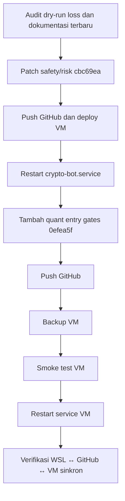

# Handoff Resmi — AutoTrade Quant Hardening, Sinkronisasi WSL–VM–GitHub, dan Deploy VM

Tanggal dokumen: 2026-08-06  
Project: `advanced_crypto_bot`  
Branch: `kiro/dryrun-activation-dashboard`  
Commit deploy terakhir: `0efea5f`  
Environment produksi/dry-run: Google Compute Engine VM `instance-20260609-044439`  
Service runtime: `crypto-bot.service`

## Status akhir

Pekerjaan selesai dan sudah disinkronkan antara WSL lokal, GitHub, dan Google VM.

| Komponen | Status | Bukti |
|---|---:|---|
| WSL lokal | Sinkron | `HEAD=0efea5f`, worktree clean |
| GitHub/origin | Sinkron | `origin/kiro/dryrun-activation-dashboard=0efea5f` |
| Google VM | Sinkron | `HEAD=0efea5f`, worktree clean |
| Bot service VM | Running | `crypto-bot.service active/running`, PID `1942145`, `NRestarts=0` |
| Smoke test VM | Lulus | `36 passed in 2.85s` |
| Backup VM | Ada | `advanced_crypto_bot/data/backups/deploy-0efea5f-20260806T032501Z` |

## Tujuan pekerjaan

Tujuan utama pekerjaan ini adalah memperbaiki kualitas AutoTrade dry-run agar data forward-test lebih valid dan risiko loss besar lebih kecil.

Fokus pekerjaan:

1. Membersihkan mismatch script antara WSL dan Google VM.
2. Push perubahan ke GitHub.
3. Deploy patch safety/risk ke VM dengan backup dan smoke test.
4. Menambahkan entry filter quant sederhana:
   - trend 5m/15m/1h/4h searah atau tidak;
   - volume spike;
   - orderbook imbalance;
   - spread/liquidity abnormal.
5. Menambahkan cost-aware execution gate.
6. Menambahkan evaluator offline untuk walk-forward, promotion gate, meta-labeling, dan calibration.
7. Restart `crypto-bot.service` dan verifikasi runtime.

## Timeline pekerjaan



## Perubahan utama

### 1. Safety/risk hardening dry-run

Commit: `cbc69ea`  
Message: `fix: harden dry-run autotrade safety gates`

Perubahan:

- BUY/STRONG_BUY sekarang memakai fresh Indodax ticker sebagai execution price.
- Entry diblokir bila:
  - fresh ticker tidak tersedia;
  - harga gagal sanity guard;
  - harga fresh terlalu jauh dari signal price.
- V4 `BAD_*` prediction sekarang memblokir dry-run entry, bukan hanya mengurangi size.
- Open-position sweeper menolak harga major-pair yang tidak masuk akal sebelum mengecek SL/TP/TIME_EXIT.
- Config baru:
  - `AUTOTRADE_REQUIRE_FRESH_ENTRY_PRICE`
  - `AUTOTRADE_FRESH_PRICE_MAX_DEVIATION_PCT`

### 2. Sinkronisasi script WSL–VM

Script yang sebelumnya tidak sama:

- `scripts/trade_report.py`

Status:

- Sudah ditambahkan ke GitHub.
- Sudah ada di VM.
- Checksum WSL dan VM cocok.

Script yang diverifikasi cocok:

- `scripts/monitor_bot.py`
- `scripts/retrain_ml_v2_v4_once.py`
- `scripts/test.sh`
- `scripts/trade_report.py`

### 3. Quant entry quality filter

Commit: `0efea5f`  
Message: `feat: add autotrade quant entry gates`

File utama:

- `advanced_crypto_bot/autotrade/runtime.py`
- `advanced_crypto_bot/core/config.py`
- `advanced_crypto_bot/tests/test_runtime_price_guard.py`

Filter baru dipasang sebagai entry filter, bukan pengganti logic sinyal utama.

Sinyal utama tetap berasal dari pipeline existing. Filter baru hanya menjawab:

> “Apakah kondisi market cukup sehat untuk mengeksekusi BUY/STRONG_BUY ini?”

Kondisi yang dinilai:

- Multi-timeframe trend:
  - 5m
  - 15m
  - 1h
  - 4h
- Volume spike.
- Orderbook pressure / bid-ask imbalance.
- Spread abnormal.
- Bid/ask liquidity kosong atau invalid.

Config baru:

- `AUTOTRADE_ENTRY_QUALITY_FILTER_ENABLED`
- `AUTOTRADE_ENTRY_QUALITY_MIN_SCORE`
- `AUTOTRADE_MTF_REQUIRED_ALIGNED`
- `AUTOTRADE_MTF_MIN_AVAILABLE`
- `AUTOTRADE_MTF_MIN_CHANGE_PCT`

Default aktif di VM:

- `entry_quality_filter=True`
- `entry_quality_min_score=2`

### 4. Cost-aware execution gate

File utama:

- `advanced_crypto_bot/autotrade/runtime.py`
- `advanced_crypto_bot/core/config.py`

Gate ini menghitung estimasi biaya round-trip:

```text
round-trip cost = buy fee + sell fee + estimated buy slippage + estimated sell slippage + spread
```

Entry diblokir jika:

- expected TP1 edge tidak cukup besar dibanding biaya;
- R/R after fees lebih rendah dari threshold optimizer.

Config baru:

- `AUTOTRADE_COST_AWARE_GATE_ENABLED`
- `AUTOTRADE_COST_EDGE_MULTIPLIER`
- `AUTOTRADE_DRYRUN_BLOCK_LOW_RR_AFTER_FEES`

Default aktif di VM:

- `cost_aware_gate=True`
- `cost_edge_multiplier=1.5`

### 5. Offline quant evaluator

File baru:

- `advanced_crypto_bot/scripts/evaluate_autotrade_quant_gates.py`
- `advanced_crypto_bot/tests/test_evaluate_autotrade_quant_gates.py`

Fungsi evaluator:

- Walk-forward replay metrics.
- Model promotion gate.
- Meta-label baseline `prob_good_trade`.
- Probability calibration report:
  - confidence bins;
  - ECE;
  - Brier score.

Contoh penggunaan:

```bash
cd advanced_crypto_bot
scripts/evaluate_autotrade_quant_gates.py --db data/trading.db --folds 4
```

Catatan:

- Script ini read-only.
- Script tidak retrain model.
- Script tidak promote model.
- Exit code `2` berarti evaluator berjalan, tetapi promotion gate menolak promote.

## Verifikasi yang sudah dilakukan

### Test lokal WSL

Command:

```bash
cd advanced_crypto_bot
venv/bin/python -m py_compile \
  autotrade/runtime.py \
  core/config.py \
  scripts/evaluate_autotrade_quant_gates.py \
  tests/test_runtime_price_guard.py \
  tests/test_evaluate_autotrade_quant_gates.py

./scripts/test.sh \
  tests/test_runtime_price_guard.py \
  tests/test_autotrade_dryrun_signal_cycle.py \
  tests/test_open_position_sweep.py \
  tests/test_evaluate_autotrade_quant_gates.py \
  -q
```

Hasil:

```text
36 passed in 27.91s
```

### Test VM sebelum restart

Command:

```bash
cd /home/wkagung/advanced_crypto_bot/advanced_crypto_bot
venv/bin/python -m py_compile \
  autotrade/runtime.py \
  core/config.py \
  scripts/evaluate_autotrade_quant_gates.py \
  tests/test_runtime_price_guard.py \
  tests/test_evaluate_autotrade_quant_gates.py

./scripts/test.sh \
  tests/test_runtime_price_guard.py \
  tests/test_autotrade_dryrun_signal_cycle.py \
  tests/test_open_position_sweep.py \
  tests/test_evaluate_autotrade_quant_gates.py \
  -q
```

Hasil:

```text
36 passed in 2.85s
```

### Smoke evaluator VM

Command:

```bash
scripts/evaluate_autotrade_quant_gates.py \
  --db data/trading.db \
  --folds 4 \
  --min-trades 1 \
  --min-profit-factor 0.1 \
  --min-expectancy-pct -999 \
  --max-drawdown-pct 999 \
  --max-ece 1.0
```

Hasil:

```text
quant_eval_smoke_ok
trades=0
promote=False
```

Interpretasi:

- `trades=0` wajar karena history dry-run sebelumnya sudah dibersihkan.
- `promote=False` benar, karena tidak ada data trade baru yang cukup untuk promote model/config.

## Deployment VM

VM:

```bash
gcloud compute ssh \
  --zone "asia-east2-c" \
  "instance-20260609-044439" \
  --project "project-a8fe20b8-0906-4445-aff"
```

Repo root VM:

```text
/home/wkagung/advanced_crypto_bot
```

App path VM:

```text
/home/wkagung/advanced_crypto_bot/advanced_crypto_bot
```

Deploy terakhir:

```text
cbc69ea -> 0efea5f
```

Backup sebelum deploy:

```text
advanced_crypto_bot/data/backups/deploy-0efea5f-20260806T032501Z
```

Isi backup:

- `trading.db`
- `code-head.tar.gz`
- `git-head.txt`
- `git-status.txt`
- `git-diff.patch`
- `db-sha256.txt`

## Restart service

Service yang direstart:

```text
crypto-bot.service
```

Status setelah restart:

```text
active
MainPID=1942145
NRestarts=0
ActiveState=active
SubState=running
```

Log systemd setelah restart menunjukkan service stop/start normal:

```text
Stopped crypto-bot.service - Crypto Trading Bot - Admin.
Started crypto-bot.service - Crypto Trading Bot - Admin.
```

Catatan:

- Yang direstart adalah service bot, bukan seluruh VM Google Cloud.
- Tidak ada reset circuit breaker/drawdown state.
- Tidak ada aktivasi real trading.

## Sinkronisasi akhir

Status akhir:

```text
WSL_HEAD=0efea5f
ORIGIN_HEAD=0efea5f
VM_HEAD=0efea5f
WSL_STATUS_COUNT=0
VM_STATUS_COUNT=0
```

Checksum file penting WSL dan VM cocok:

- `advanced_crypto_bot/autotrade/runtime.py`
- `advanced_crypto_bot/core/config.py`
- `advanced_crypto_bot/scripts/evaluate_autotrade_quant_gates.py`
- `advanced_crypto_bot/tests/test_runtime_price_guard.py`
- `advanced_crypto_bot/tests/test_evaluate_autotrade_quant_gates.py`
- `_bmad-output/implementation-artifacts/quant-autotrade-roadmap-2026-08-06.md`

## Dampak operasional

Patch ini membuat AutoTrade lebih konservatif pada entry.

Entry BUY/STRONG_BUY sekarang lebih mungkin diblokir jika:

- harga fresh tidak sehat;
- spread terlalu lebar;
- orderbook tidak mendukung;
- volume tidak menunjukkan partisipasi;
- trend multi-timeframe berlawanan;
- expected edge terlalu kecil dibanding biaya transaksi.

Ini memang bisa mengurangi jumlah trade, tetapi tujuannya adalah membuat dry-run berikutnya lebih valid dan mengurangi entry yang “kelihatan bagus di sinyal, tapi kalah oleh fee/spread/slippage”.

## Risiko dan mitigasi

| Risiko | Dampak | Mitigasi |
|---|---|---|
| Filter terlalu ketat | Bot kembali sedikit entry | Filter fail-open jika granular data tidak tersedia; threshold bisa diatur via env |
| Sample dry-run masih kecil | Evaluator belum bisa promote model | Kumpulkan forward dry-run baru setelah patch |
| Orderbook low-cap sering kosong | Banyak pair illiquid diblokir | Ini disengaja agar dry-run tidak memakai fill tidak realistis |
| Confidence ML belum calibrated | Overconfidence masih mungkin | Evaluator calibration sudah tersedia sebagai preflight |

## Rollback

Jika patch perlu dibatalkan di VM:

1. SSH ke VM.
2. Masuk repo root:

   ```bash
   cd /home/wkagung/advanced_crypto_bot
   ```

3. Checkout commit sebelumnya:

   ```bash
   git switch kiro/dryrun-activation-dashboard
   git reset --hard cbc69ea
   ```

4. Restart service:

   ```bash
   sudo systemctl restart crypto-bot.service
   sudo systemctl status crypto-bot.service --no-pager
   ```

Catatan: `git reset --hard` adalah tindakan destruktif terhadap perubahan lokal VM. Hanya lakukan jika VM clean atau setelah backup.

## Langkah berikutnya yang direkomendasikan

1. Biarkan bot mengumpulkan dry-run baru dengan patch `0efea5f`.
2. Pantau jumlah blocked entry per bucket:
   - `ENTRY_QUALITY`
   - `COST_AWARE`
   - `V4_FILTER`
   - `MARKET_INTELLIGENCE`
3. Jalankan evaluator setelah sample trade cukup:

   ```bash
   cd /home/wkagung/advanced_crypto_bot/advanced_crypto_bot
   scripts/evaluate_autotrade_quant_gates.py --db data/trading.db --folds 4
   ```

4. Jika data sudah cukup, lanjut implementasi:
   - runtime meta-label `prob_good_trade`;
   - probability calibration;
   - promotion gate yang terhubung ke `/retrain`;
   - regime-aware adaptive exit.

