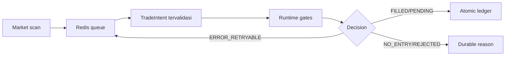

# Handoff — Perbaikan Execution Spine dan Aktivasi AutoTrade Dry-Run

> Audit checkpoint terbaru tersedia di
> [Audit AutoTrade 14 Agustus 2026](AUDIT_2026-08-14_autotrade_24h_checkpoint.md).

Tanggal: 2026-08-12

Branch: `kiro/dryrun-activation-dashboard`

Commit aktif: `ab4b7c7`

VM: `instance-20260609-044439` (`asia-east2-c`)

Service: `crypto-bot.service`

Mode uang: **DRY RUN / simulasi**

## Ringkasan status

AutoTrade dry-run telah diperbaiki, diuji, dipush, dan dijalankan kembali di VM.
Signal produksi sekarang dapat melewati Redis queue, diproses worker, dan berakhir
pada keputusan durable. Tidak ada private-order call atau aktivasi real trading.

| Komponen | Status akhir | Bukti |
|---|---:|---|
| GitHub | Sinkron | Branch origin menunjuk `ab4b7c7` |
| VM | Sinkron | `HEAD=ab4b7c7`, worktree bersih |
| Service | Aktif | Satu proses, `NRestarts=0` |
| Mode | Dry-run | Startup menerapkan `/autotrade dryrun` otomatis |
| Acceptance suite | Lulus | 46 test pada VM |
| Queue | Aktif | Enqueue, claim, process, decision, retry, dan recovery terverifikasi |
| Runtime setelah rekonsiliasi | Sehat | Tidak ada queue/runtime exception atau circuit-breaker block |
| Posisi baru | Belum ada | Outcome terbaru masih `NO_ENTRY`, bukan silent drop |

## Masalah yang diperbaiki

### 1. Signal kehilangan konteks sebelum runtime

Worker sebelumnya dapat memproses queue tanpa snapshot signal lengkap. Jalur
canonical sekarang:



Perubahan mencakup immutable intent, correlation/idempotency key, ownership
pengguna, inflight recovery, terminal acknowledgement, retry nonterminal, dan
poison-envelope rejection.

### 2. Ledger dry-run belum memiliki lifecycle atomik lengkap

Schema additive berikut menjadi jurnal normalized:

- `autotrade_intents`
- `autotrade_orders`
- `autotrade_fills`
- `autotrade_positions`
- `autotrade_rejections`

Immediate BUY, pending BUY, promotion fill, partial SELL, dan full SELL sekarang
menulis legacy projection serta normalized ledger dalam satu transaksi. Replay
intent/order/fill yang identik tidak membuat posisi ganda.

### 3. Payload produksi berisi `datetime`

Sesudah deploy pertama, runtime menemukan error:

```text
Object of type datetime is not JSON serializable
```

Commit `c2d6b3b` menambahkan serialisasi deterministic untuk rich queue payload,
termasuk regression test dengan timestamp produksi.

### 4. Timestamp hasil queue menjadi string

Setelah enqueue berhasil, formatter downstream masih mengasumsikan objek
`datetime` dan menghasilkan:

```text
'str' object has no attribute 'strftime'
```

Commit `ab4b7c7` menambahkan normalisasi timestamp ISO pada boundary formatter.
Setelah restart terakhir, tidak ada lagi error serialisasi atau `strftime`.

### 5. Circuit breaker memakai peak historis stale

Circuit breaker melaporkan drawdown 25,6%. Audit database membuktikan:

| Data | Nilai sebelum rekonsiliasi |
|---|---:|
| Saldo dry-run | Rp50.000.000 |
| Equity peak | Rp67.208.069 |
| Waktu peak | 2026-07-17 10:00:57 |
| Legacy trades | 0 |
| Normalized positions | 0 |

Peak berasal dari histori sebelum cleanup, sedangkan database trade/position
sudah kosong. Jadi drawdown tersebut bukan kerugian portfolio aktif.

Tindakan yang dilakukan:

1. Membuat salinan database sebelum perubahan.
2. Memastikan `trades=0` dan `autotrade_positions=0` dalam transaksi terkunci.
3. Mengubah hanya `drawdown_state.equity_peak` pengguna aktif dari
   Rp67.208.069 menjadi equity aktual Rp50.000.000.
4. Mempertahankan `MAX_DRAWDOWN_PCT` tanpa perubahan.
5. Restart service agar state `is_trading` kembali aktif dalam dry-run.

Backup:

```text
data/backups/trading-before-equity-peak-reconcile-20260812T093255Z.db
SHA-256: 7510bf9cf721756b46716d16e83d56c2b48dea69c6a479481f908fffd0874567
```

## Commit deployment

| Commit | Perubahan |
|---|---|
| `4186615` | Typed intent, queue recovery/settlement, atomic ledger, ownership, tests, dan dokumentasi |
| `c2d6b3b` | Serialisasi rich signal queue payload |
| `ab4b7c7` | Pemulihan timestamp setelah round-trip JSON |

## Verifikasi

Acceptance suite utama:

```bash
venv/bin/python -m pytest -q \
  tests/test_runtime_fill_reconciliation.py \
  tests/test_autotrade_dispatch_lifecycle.py \
  tests/test_autotrade_ledger.py \
  tests/test_signal_queue_recovery.py \
  tests/test_autotrade_dryrun_signal_cycle.py \
  tests/test_dryrun_safety.py \
  tests/test_open_position_sweep.py
```

Hasil VM:

```text
46 passed
```

Setelah rekonsiliasi drawdown:

```text
service=active
runtime_errors=0
circuit_breaker_blocks=0
autotrade_intents=14
autotrade_orders=0
autotrade_fills=0
autotrade_positions=0
```

Keputusan yang diamati pada sampel terakhir:

- `NO_ENTRY / NO_ORDER_CREATED`
- `NO_ENTRY / ENTRY_QUALITY`
- `NO_ENTRY / OTHER`

Ini menunjukkan jalur keputusan bekerja. Belum adanya posisi saat handoff berasal
dari gate strategi, bukan queue drop, worker mati, exception, atau circuit breaker
stale.

## Operasi dan monitoring

Pemeriksaan service:

```bash
sudo systemctl status crypto-bot.service --no-pager
pgrep -af '[v]env/bin/python bot.py'
```

Pemeriksaan startup dan error:

```bash
grep -Ei 'Startup command|DRY RUN|Signal queued|Processing signal|ERROR|Traceback' \
  logs/trading_bot.log | tail -n 200
```

Operator harus memantau:

1. Distribusi `decision.status` dan `reason_code`.
2. Queue pending/inflight serta retry yang berulang.
3. Pertumbuhan intent, order, fill, dan position normalized.
4. Drawdown terhadap peak baru hanya setelah fill dry-run bersih terbentuk.
5. Fee, spread, slippage, dan kualitas fill sebelum tuning threshold.

Jangan menurunkan gate hanya untuk menghasilkan posisi. Lakukan counterfactual
analysis: ukur apakah signal yang ditolak sebenarnya profit setelah biaya.

## Strategi lanjutan

Strategi 2 belum mengambil alih execution. Kandidat yang disetujui untuk penelitian
adalah **cost-aware regime-adaptive time-series momentum** sebagai challenger
shadow. Syarat promotion:

- universe likuid dan survivorship-aware;
- walk-forward dengan purge/embargo;
- fee, spread, slippage, latency, dan partial fill;
- Deflated Sharpe Ratio dan Probability of Backtest Overfitting;
- performa out-of-sample lebih baik daripada champion;
- Minimum Track Record Length terpenuhi.

## Rollback

Rollback kode hanya diperlukan jika error runtime baru muncul. Jangan memakai
`git reset --hard` sebelum memeriksa dan membackup worktree VM.

Untuk mengembalikan state database sebelum rekonsiliasi peak:

1. Stop service.
2. Backup database aktif.
3. Salin backup `trading-before-equity-peak-reconcile-20260812T093255Z.db` ke
   `data/trading.db`.
4. Start service.
5. Verifikasi mode tetap dry-run.

Mengembalikan backup tersebut juga mengembalikan circuit breaker stale 25,6%,
sehingga hanya dilakukan untuk investigasi atau pemulihan penuh, bukan operasi
normal.

## Batas keselamatan

- `AUTO_TRADE_DRY_RUN` harus tetap `true`.
- Jangan aktifkan private order atau real-money execution dari dokumen ini.
- Jangan reset drawdown tanpa rekonsiliasi trade, position, balance, dan peak.
- Jangan membersihkan Redis backlog atau ledger untuk menghilangkan error.
- Jangan mempromosikan strategi berdasarkan jumlah trade atau gross return saja.
