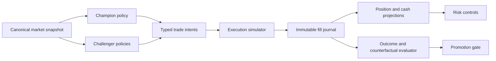
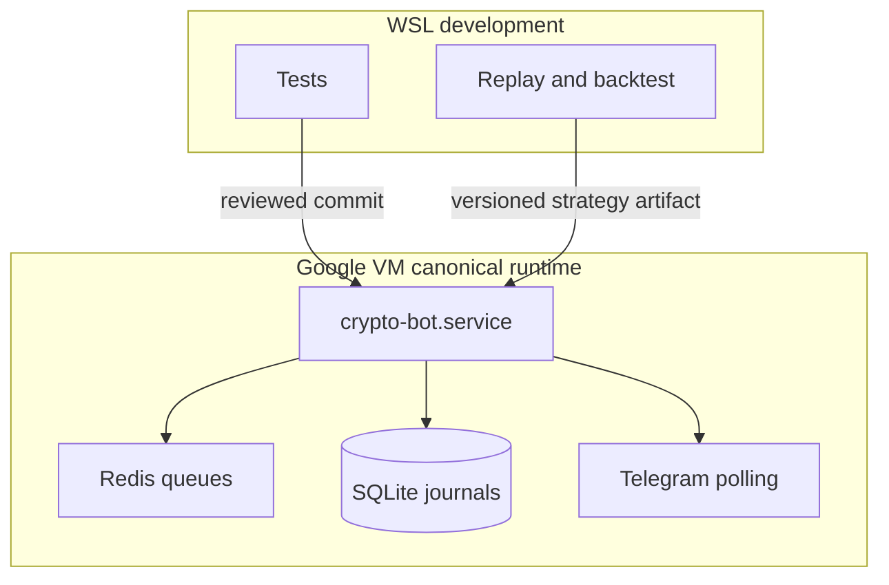

# Architecture Spine — Autotrade Dry-Run Profitability

## Design Paradigm

Use an **event-sourced champion-challenger experiment platform**. Immutable market
snapshots enter pure, versioned strategy policies. Typed intents then cross into a
shared execution simulator, normalized portfolio ledger, and risk layer. Strategy 1
is the champion; Strategy 2 and later policies are isolated challengers evaluated on
the same snapshots and cost model.

This spine defines the target-state contract. The current champion violates AD-1,
AD-2, AD-3, AD-6, AD-8, and AD-9; Phase 0 of the roadmap is the migration gate and
promotion remains disabled until those violations are closed.



## Invariants & Rules

### AD-1 — Immutable, versioned experiment identity

- **Binds:** market data, strategies, decisions, evaluation
- **Prevents:** comparing decisions generated from different inputs or mutable configuration
- **Rule:** Every decision binds a snapshot ID, strategy version, configuration hash,
  experiment ID, portfolio-state ID, universe version, simulator version, event time,
  and idempotency key. IDs are SHA-256 over canonical JSON (UTF-8, sorted keys, fixed
  decimal strings, UTC timestamps). Replay of those inputs must produce the same
  policy result.

### AD-2 — One accounting authority

- **Binds:** fills, cash, positions, equity, performance, risk
- **Prevents:** legacy and normalized tables disagreeing about open risk or P&L
- **Rule:** The normalized fill journal is the sole accounting authority. Cash and
  position projections are derived atomically from it. Legacy `trades` and
  `pending_orders` are compatibility projections and must never drive equity, risk,
  or profitability metrics. Journal money is integer IDR minor units and quantity is
  fixed-scale decimal. For each portfolio, `initial_cash + net_sell_proceeds -
  buy_costs - fees = cash`; open quantity and cost basis must reproduce exactly from
  ordered fills.

### AD-3 — Pure strategy boundary

- **Binds:** Strategy 1, Strategy 2, future challengers
- **Prevents:** policies embedding exchange calls, portfolio mutation, or inconsistent costs
- **Rule:** A strategy consumes an immutable snapshot plus explicit portfolio view and
  returns a typed intent or rejection. It cannot access network, database, wall clock,
  global mutable configuration, or execution state directly.

### AD-4 — Complete decision attribution

- **Binds:** decision layer, runtime gates, evaluation
- **Prevents:** `OTHER`, `NO_ORDER_CREATED`, or silent returns hiding policy behavior
- **Rule:** Every actionable candidate ends in exactly one durable terminal decision
  with a stable reason code and structured evidence. Generic reasons are internal
  errors, not normal policy outcomes.

### AD-5 — Symmetric counterfactual labels

- **Binds:** accepted and rejected candidates, gate tuning, ML labels
- **Prevents:** optimizing only on executed trades and mistaking selectivity for edge
- **Rule:** Accepted and rejected candidates receive forward returns over identical
  horizons anchored at the candidate's decision-eligible event time. Entry uses the
  first executable quote after configured latency; exit uses executable bid/ask at the
  horizon or the same stop/target policy. Missing/stale quotes produce `UNSCORABLE`,
  never zero return. Gate value is measured by incremental net expectancy, not
  rejection count.

### AD-6 — Realistic shared execution model

- **Binds:** all champion/challenger comparisons
- **Prevents:** paper profits created by inconsistent fee, spread, slippage, or fill assumptions
- **Rule:** One versioned simulator applies Indodax fees, bid/ask spread, size-aware
  slippage, latency, limit expiry, partial fill, and price precision to every strategy.
  A fill is the only event that moves cash or inventory; fees are booked exactly once
  in quote currency, and cancellations never move either.

### AD-7 — Walk-forward promotion only

- **Binds:** parameter selection, model training, strategy promotion
- **Prevents:** look-ahead leakage and promoting an overfit backtest
- **Rule:** Tuning, validation, and promotion windows are time-ordered and disjoint.
  Promotion metrics are net of costs and reported by regime and pair cohort.

### AD-8 — Canonical risk equity

- **Binds:** circuit breaker, exposure, daily loss, exits
- **Prevents:** false drawdown caused by projection drift and trapped open positions
- **Rule:** Equity equals canonical virtual cash plus mark-to-market normalized open
  positions. Mark price is executable bid from the canonical snapshot; a stale or
  missing mark makes equity `UNAVAILABLE` and fails new entries closed without
  rewriting the peak. Peak equity is owned by the same portfolio namespace and changes
  only after a valid valuation. A circuit breaker blocks new exposure but never blocks
  protective exits, reconciliation, or position monitoring.

### AD-9 — Single runtime writer

- **Binds:** deployment, Telegram polling, queues, experiment journals
- **Prevents:** duplicate `getUpdates`, duplicate scheduling, and cross-host experiment writes
- **Rule:** The Google VM is the sole always-on writer and Telegram poller. WSL is for
  tests and deterministic replay unless launched with isolated credentials, queues,
  database, and experiment namespace. The VM must hold a renewable Redis lease with a
  monotonically increasing fencing token; every queue claim and journal write carries
  that token and storage rejects a stale epoch. Local process locks are advisory only.

### AD-10 — Challenger isolation before promotion

- **Binds:** Strategy 2 and future challengers
- **Prevents:** a partial shadow hook being treated as profitability evidence
- **Rule:** A challenger owns an isolated virtual portfolio and completes candidate,
  entry, pending, fill, protection, exit, and outcome lifecycle on the same market
  feed. It cannot veto or mutate the champion before promotion.

### AD-11 — Explicit aggregate ownership and namespace

- **Binds:** experiments, portfolios, orders, fills, positions, outcomes
- **Prevents:** two strategies sharing cash, positions, or idempotency domains
- **Rule:** `experiment_id` owns one immutable strategy/config/simulator tuple;
  `portfolio_id` belongs to exactly one experiment; orders, fills, positions, and
  valuations carry that portfolio ID. Position aggregate key is
  `(portfolio_id, pair)` and no cross-portfolio mutation is allowed.

### AD-12 — Ordered lifecycle and retry semantics

- **Binds:** queue, execution, ledger, projections
- **Prevents:** retries, out-of-order events, or concurrent exits corrupting state
- **Rule:** Each aggregate event carries `aggregate_id`, monotonically increasing
  `sequence`, immutable `event_id`, causation ID, correlation ID, and fencing token.
  Append uses compare-and-swap on expected sequence; duplicate event IDs are no-ops,
  sequence gaps/conflicts fail closed, and projections advance in journal order.

### AD-13 — Evidence preservation and migration

- **Binds:** schema changes, backup/restore, experiment retention, deployment
- **Prevents:** irreproducible reports or mixing incompatible accounting histories
- **Rule:** Schema and semantics versions are recorded with every experiment. A
  migration requires preflight invariant audit, immutable backup plus checksum,
  deterministic reconciliation report, and post-migration audit before service start.
  Snapshots, decisions, fills, outcomes, configuration, and environment manifest are
  retained together for the experiment's review lifetime.

### AD-14 — Fail-closed promotion

- **Binds:** champion selection and deployment
- **Prevents:** implicit promotion from incomplete, stale, or operator-unapproved evidence
- **Rule:** A versioned promotion policy evaluates a sealed out-of-sample report. Any
  missing metric, integrity failure, threshold ambiguity, or absent operator approval
  rejects promotion. Promotion creates a new champion version and preserves the old
  champion as rollback/shadow; it never mutates an existing experiment.

## Consistency Conventions

| Concern | Convention |
| --- | --- |
| Identity | Canonical SHA-256 identity including experiment, portfolio, snapshot, config, simulator, and operation |
| Pair | Lowercase Indodax symbol such as `btcidr` at persistence boundaries |
| Time | UTC event time in ISO 8601; ingestion time stored separately |
| Money | Integer IDR minor units; fixed-scale decimal quantity; no `REAL`/binary float in the target ledger |
| Returns | Decimal ratio internally; display percentage only at presentation boundaries |
| Mutation | Fill journal append and projection update share one SQLite transaction |
| Errors | Stable reason code plus structured evidence; prose is diagnostic only |
| Configuration | Immutable versioned snapshot/hash per experiment |
| Logging | Correlation ID, snapshot ID, strategy version, pair, and terminal outcome |

## Stack

Current environments are intentionally recorded as evidence of drift, not approved
pins. Phase 0 must produce a lockfile and persist its hash with every experiment.

| Name | WSL verified | VM verified |
| --- | ---: | ---: |
| Python | 3.12.3 | 3.13.5 |
| SQLite | 3.45.1 | 3.46.1 |
| pandas | 3.0.2 | 3.0.3 |
| Redis client | 7.4.0 | 8.0.0 |
| python-telegram-bot | 22.7 | 22.7 |
| scikit-learn | 1.8.0 | 1.9.0 |

## Structural Seed

```text
market_data/                 # canonical snapshots and quality status
strategies/
  champion/                  # current production dry-run policy adapter
  challengers/strategy2/     # pure patient-swing policy and isolated state machine
execution/                   # shared cost/fill simulator
portfolio/                   # integer/decimal journal, projections, valuation, reconciliation
evaluation/                  # outcomes, counterfactuals, walk-forward reports
operations/                  # single-writer lease, health and promotion controls
```



## Capability → Architecture Map

| Capability / Area | Lives in | Governed by |
| --- | --- | --- |
| Snapshot capture | `market_data/` adapter over poller/cache | AD-1, AD-9 |
| Champion decision | Strategy 1 adapter | AD-1, AD-3, AD-4 |
| Strategy 2 shadow | `autotrade/strategy2/` → challenger boundary | AD-3, AD-10 |
| Dry-run fills | shared `execution/` simulator | AD-2, AD-6 |
| Cash, position, equity | `portfolio/` normalized ledger | AD-2, AD-8 |
| Gate evaluation | `evaluation/` counterfactual labels | AD-4, AD-5 |
| Promotion | sealed walk-forward report and operator gate | AD-7, AD-10, AD-14 |
| Deployment | systemd VM runtime; fenced WSL replay | AD-9, AD-13 |

## Deferred

- Live-money execution remains out of scope until a separate security and operational review.
- Migration away from SQLite waits until measured write contention or dataset size requires it.
- Exact Strategy 2 indicators and parameters belong to its experiment spec, not this spine.
- The initial promotion thresholds in the roadmap are `[ASSUMPTION]` values requiring operator approval.
